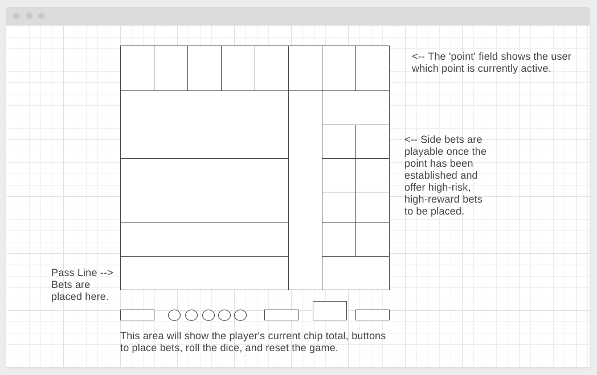

# Craps Simulator
##
## Objective:
### - Create a browser-based game that accurately models playing a standard game of craps.
##
##
##
## To play the game:
### Click [here](https://www.placeholder.com) to play the game.
##
##
## Motivation:
### I learned how to play the game of craps onboard a cruise ship while vacationing with my family when I was younger.  I was drawn to the social aspect of the game and how despite betting independently from one another, people at a table encourage each other so that everyone does well.
## Prototype View:
### Here is a wire-frame of how the playing field will be set up:

## Technology Implemented:
- JavaScript
- CSS
- HTML
- Git 

## Pseudocode:
- Bet is placed
- Roll the dice

# User Experience:
## User Persona #1:
### Abby works for a tech company in Austin, Texas.  Her employer frequently sends her to tech conferences around the globe.  Abby has an upcoming trip to Las Vegas, and knows from previous trips that her co-workers **love** playing craps as a group.  Abby wants to learn the rules of the game, how the game flows, and most importantly the lingo that goes along with it.  

## User Persona #2:
### Frankie is a card-shark and loves to gamble.  He frequently visits the riverboat casino in his home town.  Frankie is becoming tired of winning so much at all the card games that he has mastered.  He is looking for a way to practice the game over and over so that he can sharpen his skills and become a pro before his next casino visit.

## Minimum Viable Product:
- As a user, I should be able to see what my chip total is and increment my next bet by clicking on different buttons.
- As a user, I should be able to click a button to simulate a dice roll.
- As a user, I should be able to place a bet on any of the point values at the top of the board once the point has been established.
- As a user, I should be able to place a bet on any of the side bets once the point has been established.
- As a user, I should be able to see the current bets that are active and have the ability to cancel them if the rules of the game permit it.
- As a user, I should be able to hear dealer call-outs that mimic those heard on traditional craps tables.
- As a user, I should be able to hear the sound of the dice rolling when I push the button to roll the dice.
- As a user, I should see a message showing the status of my last roll.
- As a user, I should be paid the correct amount when I win a bet.

## Stretch Goals:
- Animated dice rolls
- Stylized casino chips
- Texturized playing field to mimic a felt surface
- Help button(s) for different fields on the board
- Suggested bet options
- Ability to play odds on the Pass Line
- Remove the list of active bets and replace with chip images on the bet fields
- Add a list of previous rolls
- Add a list of previous roll frequency
- Add selectable 'felt' colors for the play field

